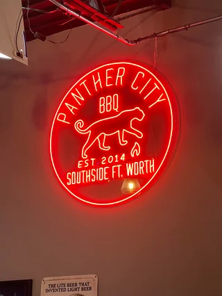

First established in 2014, [Panther City BBQ](https://www.panthercitybbq.com) has been serving up top quality Texas style BBQ for nearly a decade now. Located in the southern part of Fort Worth, Texas, the quality of their food hit my nose the second I got out of the car about 50 feet away from their giant outdoor offset smokers. The blend of oak and hickory smoke fills the air all around their restaurant and the scents get even better once you're inside the doors. Although if you don't want to spend too much time in line outside, I recommend you get there outside of the lunch or dinner rush times. I got there around 11:30 and the line was almost already at the door.

### Top-Tier Texas BBQ

As someone who has eaten plenty of great BBQ and also makes their own in backyard smokers, Panther City was ticking a lot of boxes for me right off the bat. Their [menu](https://www.panthercitybbq.com/bbq-menu/), which has a great selection of traditional BBQ meats and sides, offers meats by the half-pound, as well as other great Tex-Mex style options in taco and burrito form. Their brisket elote also looked really good - I saw someone with a cup of it as I walked by their table.

### Hell's Half Acre Platter

Coming in at $100, is their platter named **Hell's Half Acre**, which included brisket, pulled pork, smoked turkey, pork ribs, jalapeño cheddar sausage, and pork belly burnt ends - as well as three medium sides. This is a **large** amount of food - I shared this with 3 other people and we couldn't even finish it all. We also added a large side of their spicy smoked mac & cheese, topped with some fresh sliced jalapeños, which give a bit more of a kick than the pickled variety. My only regret was not having room to try their banana pudding or their nutter butter cheesecake pudding, which sounded very tempting.

### Final thoughts

If you're in the Fort Worth area and love BBQ, this place is a must-try. Not only are they one of the best BBQ places in Fort Worth, but they made [***TexasMonthly***'s #10 spot](https://www.texasmonthly.com/interactive/top-50-bbq-2021/#panther-city-bbq) for best BBQ restaurant in all of Texas. The only thing I could perhaps mark off a little for is the amount of smoke flavor in their brisket, but that was the only thing I could even be nit-picky about. The pork-belly burnt ends were delicious and melt-in-your-mouth tender. The sausage was done right as well, with real cheddar in them, not some cheese sauce or something with an odd flavor and texture to it. The sausage casings were tight and snappy too, almost making it difficult to spear with a plastic fork. The pulled pork, just like the brisket, was dripping with juices, and had great bark on it. The mix of salt, rendered fat, crispy ebony colored bark, and smoke flavor made this trip one to remember. Get there early enough to make it easy to find a seat and enjoy some delicious Texas BBQ.