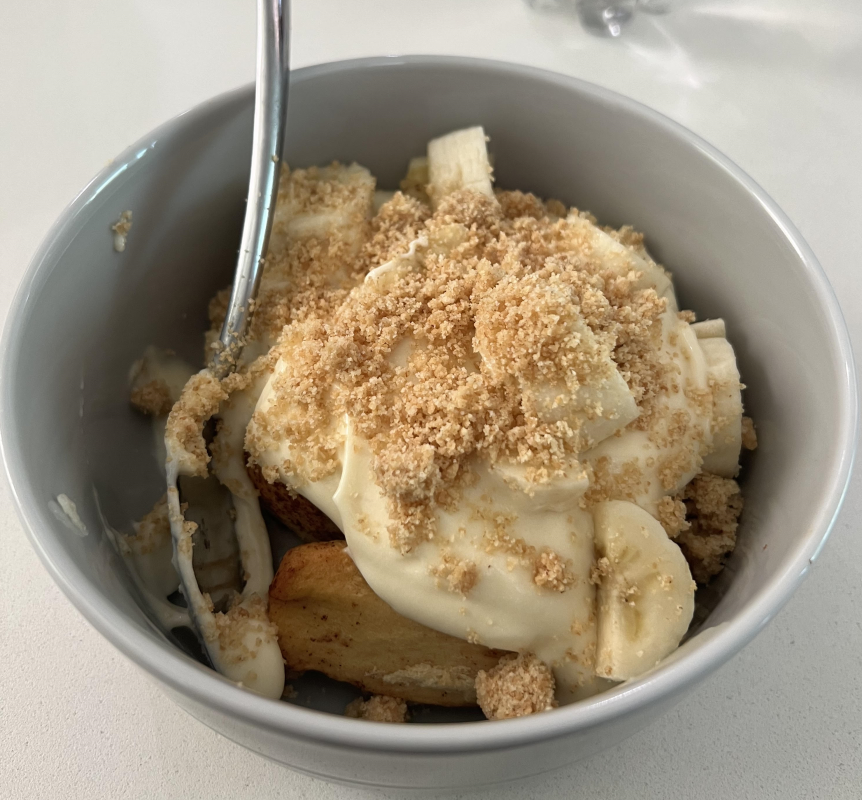

As 2023 starts winding down and we reach the time of year when some of my favorite holidays are on the calendar, my wife and I sat down to plan our Thanksgiving meal. My family has never really been huge fans of the  conventional turkey and common sides you see at most American Thanksgiving spreads - although we have celebrated that way a few times. I of course, being me, offered to make some delicious smokey BBQ meats and try my hand at a banana pudding recipe. Lucky for me, she agreed! I thought it might also be fun to memorialize the occasion by writing about it and sharing some photos so here I am doing just that.

### The Full Menu

With my kids getting older and leaving the nest, I figure there might be a limited number of times left where we're all living close enough to be able to get together on Thanksgiving, so might as well go big while everyone can enjoy it. Here's what I was in charge of:

* Beef Brisket
* Pulled Pork with Hog Sauce (and a South Carolina mustard bbq sauce)
* Pork Spare Ribs
* Jalapeno Cheddar Sausage
* Rhodes Yeast Dinner Rolls (easy to toss in the oven)
* Cinnamon roll banana pudding (my first attempt)

Some other items that made the menu that I didn't have to prepare

* Mac & Cheese w/ panko topping
* Mashed Potatoes (mix of red & Yukon gold)
* Fruit Salad
* Sweet Potato Casserole
* Peppermint Chocolate Cheesecake
* Artichoke Dip (Bread bowl hollowed and used for dipping bread pieces and filled with an artichoke dip)
* Veggie Tray with Ranch dip

Some of these dishes don't take that long at all to prepare, while others (like some of the meats) take an entire day - at least with the way I do them. So I had to plan out a schedule in advance. Two of my kids had accepted invites to their partner's Thanksgiving dinners also, so we planned to eat around noon in order to have plenty of time to both eat and play a few games before they had to hit the road to attend their "Round Two" gatherings.

### Jesse, it's time to cook.

The brisket went on first since it needs a long time to cook, plus I can easily hot hold it for a long time in the oven. While the brisket was going I made the hog sauce and the mustard BBQ sauce. Once the brisket was out of the smoker the pork butt went in. I set the smoker to 300 degrees, and put it in to cook around 11 pm, setting an alarm to get up and check on it around 4 am. Then I trimmed and rubbed the ribs to be tossed on early in the morning around 5 am. The sausages would go on last around 9am because they really only need a couple hours or so to cook. While I enjoyed all the BBQ I cooked, I wish I wouldn't have had to hold the brisket for so long, since it ended up drying out a little bit by the time we sat down to eat. I typically only have to hold it for around 4-6 hours, and this time it was more like 13-14 hours. The ribs turned out great, though I might have left them cook just a little too long since they were a challenge to cut since they were so tender and falling off the bone a bit. The sausage turned out probably the best of everything, which isn't saying much with how easy they are to cook. The pulled pork was good and will make for some good leftover pulled pork sandwiches.

")

### The Cinnamon Roll Banana Pudding

I got this idea from a BBQ restaurant in Fort Worth that I had the banana pudding at. I don't think they actually used cinnamon roll dough (probably just something like short cake) but at first I thought it was cinnamon roll dough which is what sparked the idea. You could definitely use short cake or maybe bundt cake if you're not a big cinnamon roll fan like I am. This turned out pretty delicious though. All I had to do for this was buy a tube of the Pillsbury "Grands" cinnamon rolls (if you're feeling ambitious make your own cinnamon rolls). After they came out of the oven I put them on a cooling rack then eventually into a Ziplock bag to stay fresh. I cut off the "top" of each roll to make them flat on top, similar to what cake decorators do for their cake rounds. Then I added the banana pudding to cover the top, sliced some fresh banana coins on to the pudding, then covered that with a nilla wafer + honey graham cracker crumble (mixing in melted better) that I made in a food processor and some (optionally) whipped cream. I wasn't the only one who found this to taste great, so I'm glad the execution came together.

### The Best BBQ?

The best BBQ is the kind you get to share with people. While I wouldn't say this was the best stuff I've ever cooked, it was still delicious and I got to share it with family which made it that much better. I also learned a couple of lessons during this cook that I will take forward with me into my next BBQ cook. It's always nice to get some more experience along the way with each cook so you get just a little better each time.