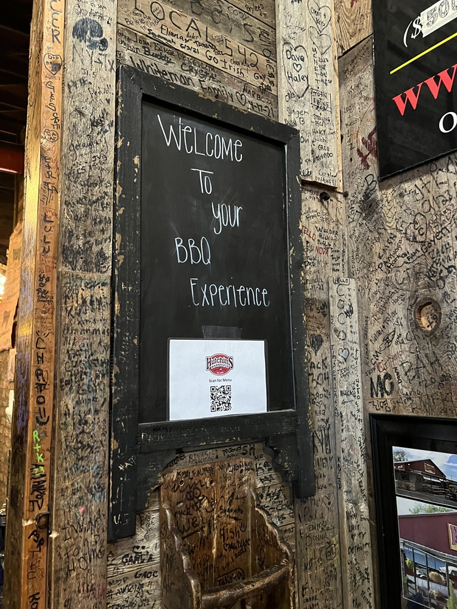
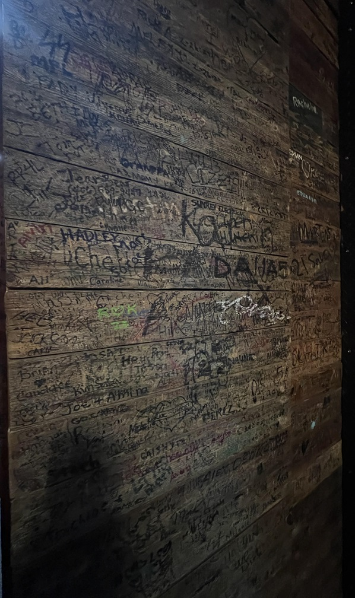
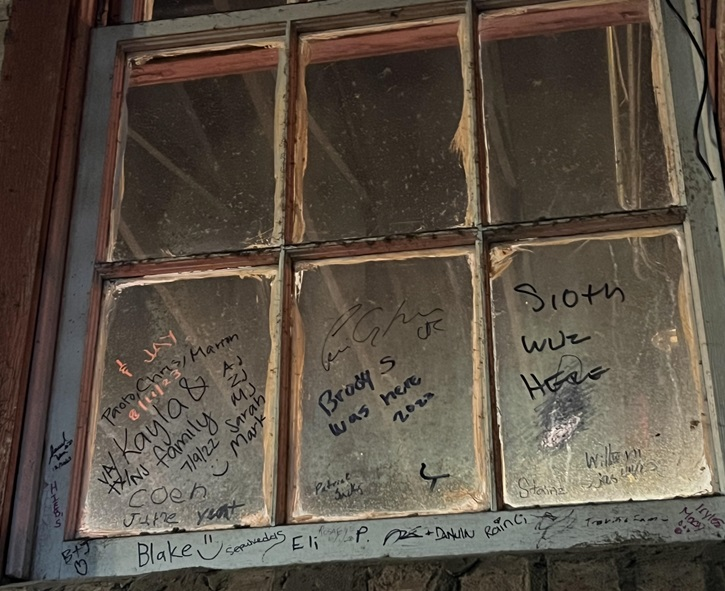
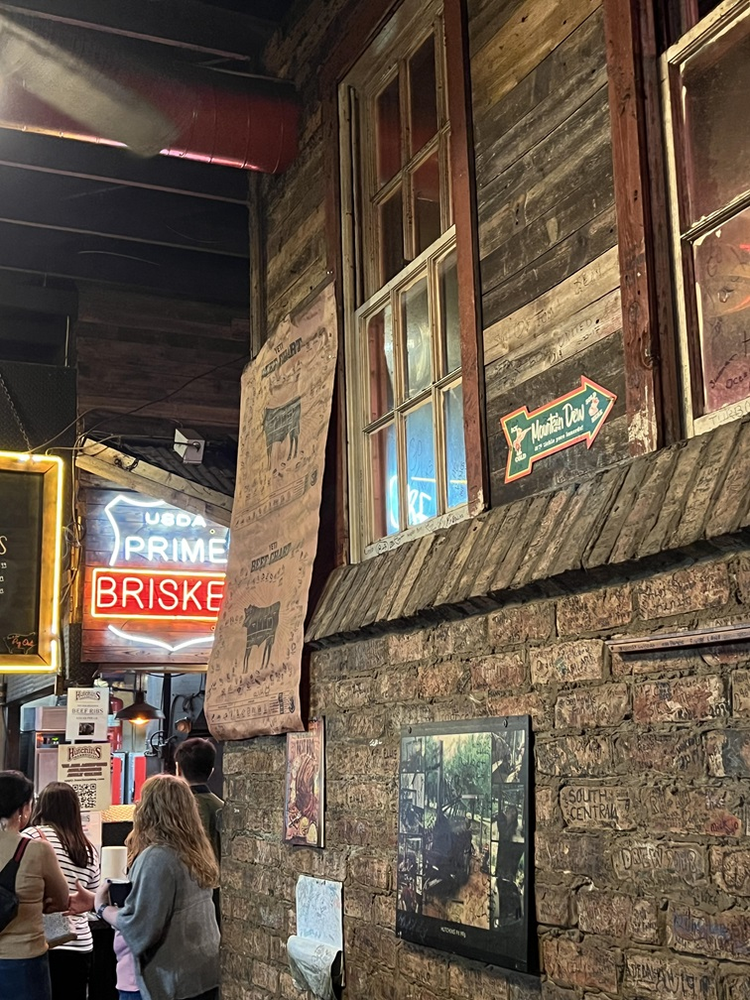
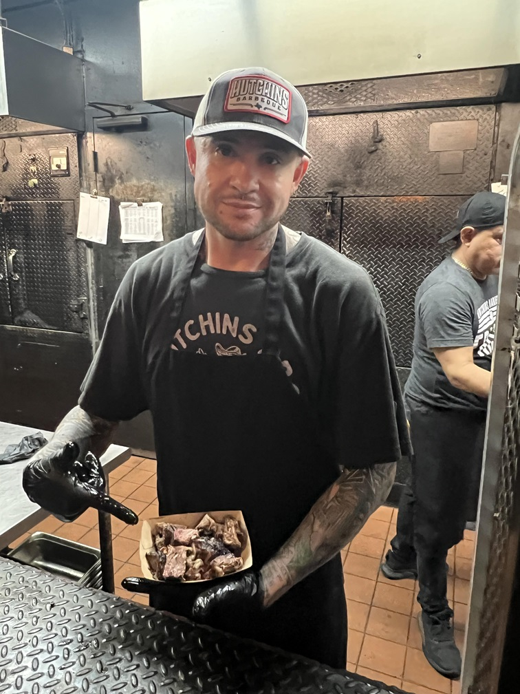
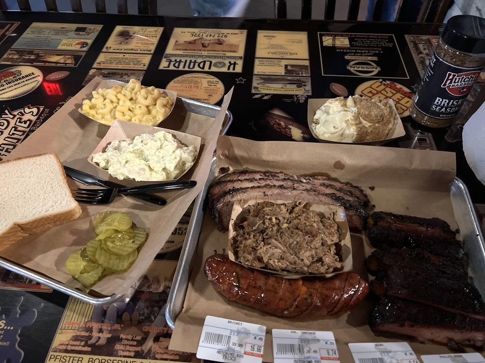

During my latest Texas trip to the Dallas / Fort Worth area (or "DFW", or "The Metroplex" as the locals say) I decided to give [Hutchins BBQ](https://hutchinsbbq.com/frisco-menu) a try. I arrived at their Frisco location around 5:45, fortunately in time to beat the dinner rush. Their peak busy time in the evening causes the line to back up all the way out the doors and into the parking lot, which I noticed as I exited to head back to my hotel room. A line of that length didn't surprise me though, given the quality of what I had just finished eating.

In my experience with Texas BBQ restaurants so far, I've come to realize that the smell of smoked meats should hit your nose well in advance of you entering the doors and Hutchins definitely checked that box. I also enjoyed looking at the scribble graffiti all over the inside walls that contributed to the feeling that visiting Hutchins BBQ was a rite of passage for those that had visited there before me. Visitors names, which states they had travelled from, and in which year appeared all over the walls, windows and pretty much any surface they could reach. It almost felt like I was waiting in line at some kind of BBQ amusement park ride.

## Speaking of waiting in line...

During my short wait (about 10 minutes) I twice got handed a sample of something to try and pass to the people behind me. The first sample looked and tasted like brisket, and the second sample was beef rib. It was a nice way to get a little taste of what you were about to order once you reached the counter. 

## The Meat Counter

Once you reach the front of the line there is a large meat counter with people holding knives ready to put whatever you order onto a tray for you. And they remind you to take a second tray for sides. They brushed the ribs I ordered with a little warm BBQ sauce when I ordered, which was a nice touch. They use some lamps to keep the meat warm as well, without drying out the meat much which was also nice. I ended up ordering 1/2 lb of brisket, one jalapeno cheddar sausage, 1/2 lb of pulled pork, and 1/2 lb of pork ribs. I was very tempted to also order one of their beef ribs - which looked **AMAZING** - but I knew I only had so much room in my stomach. Something to look forward to trying next time, I guess.

Hutchins BBQ also had a pretty nice array of sides, which encompassed the typical Texas BBQ sides like mac & cheese, collard greens, fried okra, potato salad, and more. I opted for the potato salad and mac & cheese. This ended up being my total meal, along with the complimentary banana pudding for dine-in customers (and the same for their cobbler, too).

