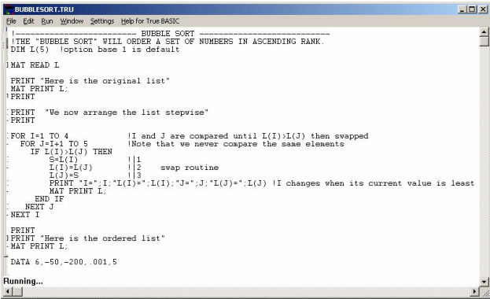

Hey there, thanks for visiting my website. I'll try to keep this short since I would imagine most people don't have much of an attention span when it comes to learning about me.

I'm a California kid (NorCal/East Bay/Antioch) that ended up moving to the Northwest Phoenix suburbs (Surprise, Arizona) in 2006 and that's where I've been ever since. Do I love the heat? Absolutely not, but I have learned how to begrudgingly tolerate it.

The home page here mentions "Code, Sports, Music, and Texas style BBQ". Let's discuss these things, in that order.

## Code

I got my first taste for programming in high school (1995) writing True BASIC code on Windows 95. It looked something like this:

(Although I think if we had been asked to write a Bubble Sort routine back then most of our brains would have melted). Although I wasn't very good at writing code back then, I still found it interesting and so I dorked around on my PC at home with QBasic on Windows 95, and the following year took another programming class, this time writing code with Borland's Turbo Pascal 4.0

Right after high school I was fortunate enough to take a job with an uncle of mine doing Visual Basic programming and got to learn some neat stuff using Visual Basic 5. I didn't realize it at the time, but gaining computer skills (especially programming) was going to be pretty valuable, and something I could teach myself. Flash forward 25 years, and I'm now a senior full stack software engineer that does web, mobile, cloud, database, and all kinds of apps with different platforms and languages. It's been challenging and always keep me learning, which is something I enjoy.

## Sports

As I mentioned, I grew up in the Bay Area in the 80's and 90's and played a lot of organized sports pretty much year-round. Baseball, Basketball, Soccer, and the sport I eventually became completely obsessed with - Tennis. Growing up where I did and when I did: Go A's! Go 49ers! Go Warriors! (I have no hate for the Giants really, but I quietly enjoy seeing the Raiders struggle. Although if I'm being honest, I find myself feeling less animosity towards the Raiders as time passes. I first got into Tennis as a sophomore in high school. No lessons or coaches or anything really, just practices during the season. I eventually played #1 Singles for my high school team. I didn't really get decent at the sport until I picked it back up against and started practicing with my own ball machine in my early 20's. I eventually ended up playing USTA Leagues (4.5 level) and some other Open level leagues for a while until a shoulder injury sidelined me for a while. I'm about as knowledgeable about the sport and the professional players as it gets though and still regularly watch not only the four majors every year, but all the smaller, lesser-known tournaments throughout the insanely long 11 month long season every year.

## Music

Music is as big a part of my life as anything else so it felt right to give it a place here. I grew up playing piano from a young age, and dabbled in the trumpet for several years as well. I've tried several times to try and get better at guitar and the drums, but it's just a future hobby for me these days. Piano is where I went the furthest skills-wise and ended up performing several classical pieces at recitals from composers like Beethoven, Liszt, Rachmaninov, and others. Piano certainly helped with my keyboard typing as well and had me typing at about 50 WPM on the typing tests in middle school!

## Texas style BBQ

This is a fairly recent one for me. I got bit by the BBQ bug only a couple of years ago (so, about 2021) but it's become kind of an obsession of mine in that short time. I've watched hundreds of hours of video content, mostly on YouTube, about the best methods for cooking delicious BBQ foods including brisket, pulled pork, pork ribs, beef ribs, sausage, turkey, and various types of sauces. I have a couple of different smokers in my backyard that I use to practice perfecting the craft of Texas style BBQ. My favorite cut to cook is still brisket, which I've just about perfected getting a really dark bark, a rich smokey flavor, and the juiciest nicely rendered fat with a thick reddish-pink smoke ring on every slice. Pulled pork is probably my second favorite. I'm fortunate to work remotely for a company based in the Dallas/Fort Worth area that I travel to the offices of occasionally and get to hit up BBQ restaurants in the area while I'm visiting.

If you read down this far, thanks for reading! If you want to drop me a line you can check out the links at the bottom of the home page.

\--Jason